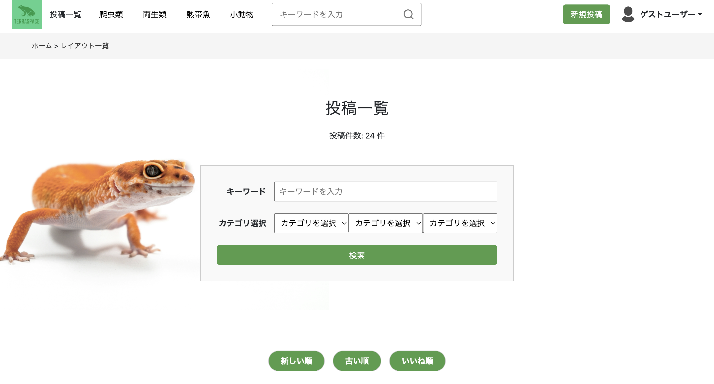

## TERRA SPACE

## 1. サービス概要

**TERRA SPACE** は、主に爬虫類・両生類の飼育環境にテラリウムの要素を取り入れたレイアウトを、  
**投稿・共有・閲覧できる Web アプリケーション**です。

「飼育に慣れてきたから、もう一歩踏み込んだ空間を作ってみたい」  
そんな飼育者が、他ユーザーのレイアウト事例から**アイデアを得られる場**を目指しています。

---

## 2. サービス画像

### ホーム画面  

### 投稿一覧ページ  

---

## 3. サービスURL

URL: https://terra-space-3a16a086e2f2.herokuapp.com/

---

## 4. デモユーザー情報

以下のアカウントでログイン可能です。

- メールアドレス：**test@example.com**
- パスワード：**password123**

> ログイン後、投稿・編集・お気に入りなどの機能をお試しいただけます。

---

## 5. 開発背景

趣味で爬虫類・両生類を実際に飼育しており、日々の管理を考慮してシンプルなレイアウトで飼っていました。  
しかしある時、それぞれの生息環境を再現し、その空間で飼育を楽しむ「テラリウム」というスタイルを知り、私も挑戦してみたいと感じました。

基本的なテラリウムの情報は見つかるものの、より発展的なレイアウト事例や、実際の飼育者のアイデアをまとめて見られる場所はあまり多くありません。

それがきっかけで、見た目の美しさや独自性にこだわったレイアウトを、  
他の飼育者と共有・交流できる場としてこのアプリを開発しました。

---

## 6. 機能一覧

### 投稿機能
- レイアウトの投稿（画像／説明／カテゴリ）
- 投稿の編集・削除
- 新着順／人気順での並び替え

### 閲覧・検索機能
- キーワード検索
- カテゴリによるフィルター

### ユーザー機能
- 登録・ログイン・プロフィール編集
- ゲストログイン（登録不要でレイアウトの投稿体験できます）

### リアクション機能
- いいね：レイアウトの評価が可能
- お気に入り：お気に入り一覧より投稿の見返しが可能

---

## 7. こだわった点

- **リアクション設計**：「いいね」や「お気に入り」で他ユーザーとのつながりが生まれる
- **カテゴリ・検索の柔軟性**：閲覧者が目的に応じて好みのレイアウトを見つけやすい
- **UI / UX**：自然を意識し落ち着いた配色とシンプルな導線で、情報が目に入りやすいよう設計

---

## 8. 主な使用技術

### フロントエンド
- HTML / CSS / JavaScript
- Bootstrap（スタイリング）
- Font Awesome（アイコン）

### バックエンド
- Ruby 3.0.4
- Ruby on Rails 6.1.7.10
- PostgreSQL（データベース）

### インフラ・環境
- Devise（認証、ゲストログイン含む）
- Heroku（デプロイ準備中）
- Git / GitHub（バージョン管理）
- ER図生成:rails-erd + Graphviz

---

## 9. ER図

本アプリのデータ構造を表したER図です。  
ユーザー、投稿（レイアウト）、カテゴリ、リアクション系（いいね・お気に入り）などで構成されています。

---

## 10. 今後の展望

- 投稿にコメント機能を追加し、より詳細な評価を可能にする
- レイアウトに「使用アイテムリスト」を追加して参考性を向上
- カテゴリの階層化（自己参照型モデルを活かす or ancestor gemの導入）

> 現在は自己参照型カテゴリを導入していますが、カテゴリが増えて複雑化してきた場合は  
> ancestor gemによるより柔軟な階層管理を検討しています。
