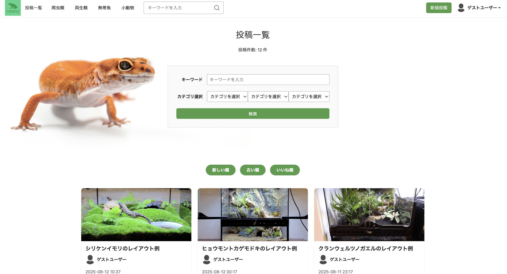
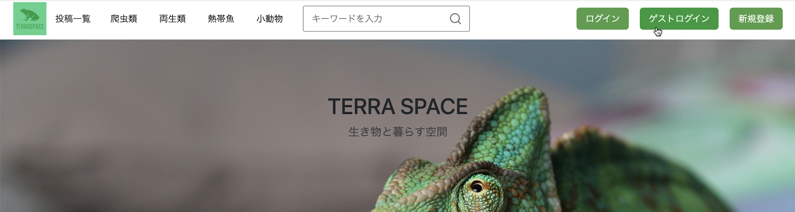
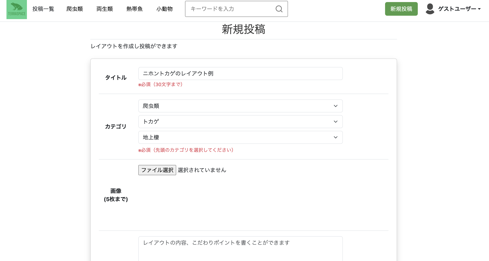
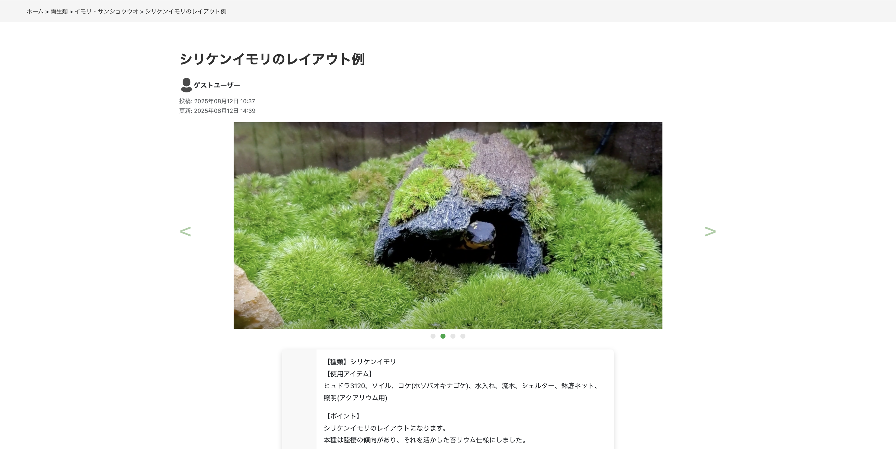
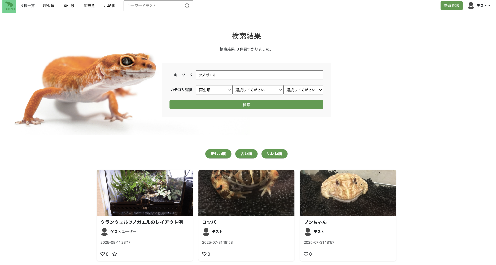
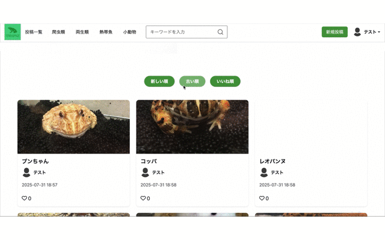
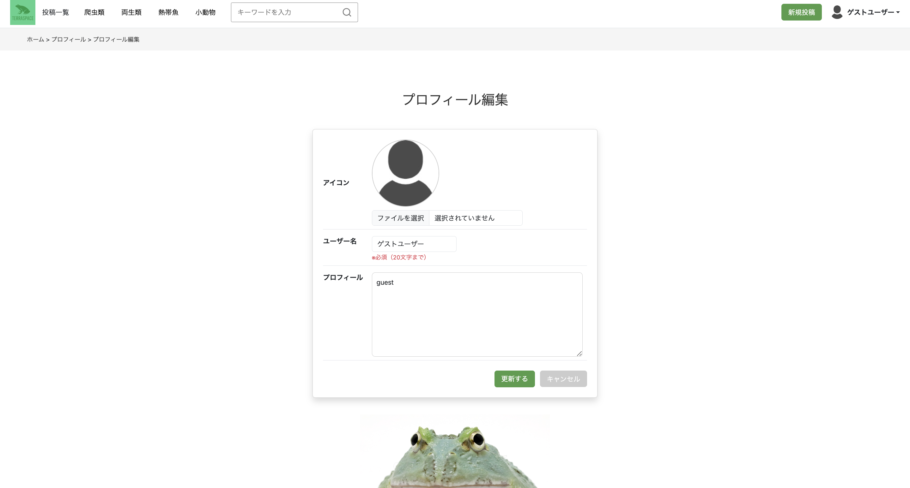
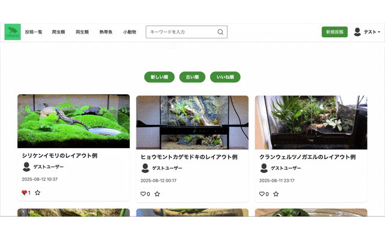
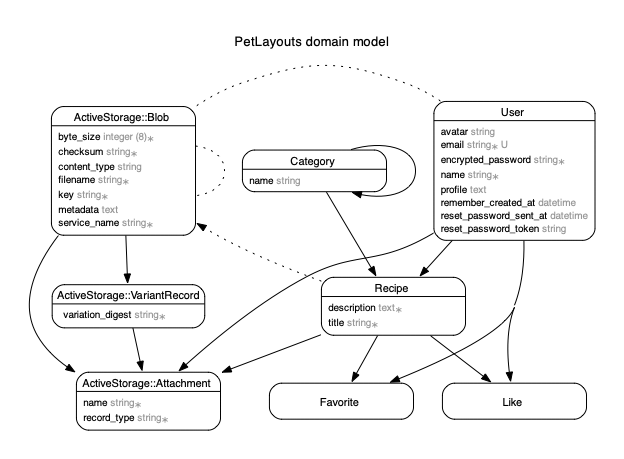

## TERRA SPACE

## 1. サービス概要

**TERRA SPACE** は、主に爬虫類・両生類の飼育環境にテラリウムの要素を取り入れたレイアウトを、  
**投稿・共有・閲覧できる Webサービス**です。

「飼育に慣れてきたから、もう一歩踏み込んだ空間を作ってみたい」  
そんな飼育者が、他ユーザーのレイアウト事例から**アイデアを得られる場**を目指しています。

---

## 2. 開発背景

趣味で爬虫類・両生類を実際に飼育しており、日々の管理を考慮してシンプルなレイアウトで飼っていました。  
しかしある時、それぞれの生息環境を再現し、その空間で飼育を楽しむ「テラリウム」というスタイルを知り、私も挑戦してみたいと感じました。

基本的なテラリウムの情報は見つかるものの、より発展的なレイアウト事例や、実際の飼育者のアイデアをまとめて見られる場所はあまり多くありません。

それがきっかけで、見た目の美しさや独自性にこだわったレイアウトを、  
他の飼育者と共有・交流できる場としてこのアプリを開発しました。

---

## 3. サービス画像

### ホーム画面  

### 投稿一覧ページ  

 

---

## 4. サービスURL

**[TERRA SPACEはこちら](https://terra-space-3a16a086e2f2.herokuapp.com/)**

---

## 5. ゲストログイン

ゲストログインボタンからワンクリックでログインできます。
 ゲストユーザーでは通常ユーザーと同様の機能を利用することができます。

---

## 6. 機能一覧

- **レイアウト投稿機能**  
新しいレイアウトを投稿できます。
  

- **レイアウト詳細表示**  
使用アイテムや工夫したポイントを確認できます。  
  

- **投稿編集・削除**  
  自分の投稿を編集または削除可能。 

- **検索・ソート機能** 
  キーワード検索、カテゴリ検索、
   新しい順／古い順／いいね順のソートが可能。 
    

    

- **ユーザー機能**  
  ユーザー登録、プロフィール編集が可能。  
   

- **ゲストログイン**  
  登録不要で全機能を体験できます。

- **リアクション機能**  
  投稿に対して「いいね」や「お気に入り」を付けることができます。  
    

  

## 7. 開発時の工夫

- **検索性の向上**  
  カテゴリ＋キーワード検索を組み合わせ、目的のレイアウトを素早く見つけられるよう実装。

- **ゲストログイン機能**  
  登録のハードルを下げるため、通常ユーザーと同等機能を体験できるゲストログインを導入。

- **UI / UXの工夫**  
  Bootstrapを活用し、落ち着いた配色とシンプルな導線を設計。画像を大きめに配置し、視認性を重視。

---

## 8. 主な使用技術

### フロントエンド
- **HTML / CSS / JavaScript**
- **Bootstrap**  
  - 統一感あるUIを効率的に実装できるため採用
- **Font Awesome**  
  - 「いいね」「お気に入り」など、視覚的なUIに必要なアイコンが豊富なため

### バックエンド
- **Ruby 3.0.4 / Ruby on Rails 6.1.7.10**  
  - MVCモデルで効率的な開発が可能なため  
- **PostgreSQL**  
  - Herokuとの相性が良いため

### インフラ・環境
- **Devise**  
  - 認証・ゲストログインを効率よく実装するため
- **Heroku**  
  - 学習環境で使用しており、運用実績があるため
- **Git / GitHub**（バージョン管理）
- **ER図生成：rails-erd + Graphviz**

---

## 9. ER図

ユーザー・投稿・カテゴリ・リアクション（いいね／お気に入り）で構成。

---

## 10. 今後の展望

 ### カテゴリ階層化の強化（優先度：高）
  現在は自己参照型モデルを使用していますが、カテゴリ数の増加に備え、ancestry gemで柔軟な階層管理を実装予定。

 ### コメント機能の追加（優先度：中）
  投稿に対してフィードバックや質問が可能になり、コミュニティ性を高める狙い。

 ### 使用アイテムリストの表示（優先度：低） 
  投稿者が利用したアイテム情報を簡単に共有でき、閲覧者の参考性を向上。
